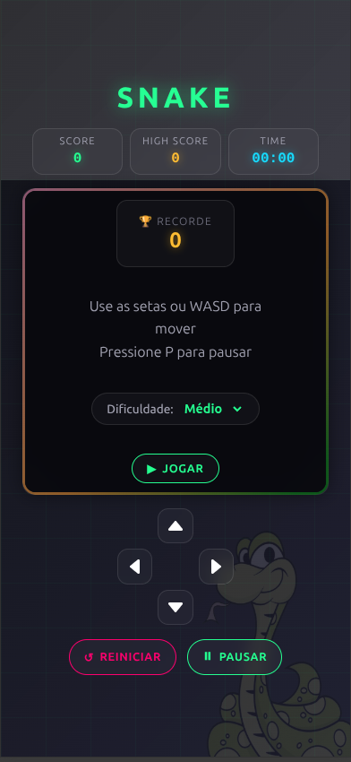

# 🐍 Snake Game - Modern Edition

<div align="center">



**Jogo Snake clássico com design moderno, TypeScript e arquitetura profissional**

[](https://www.typescriptlang.org/)
[](https://developer.mozilla.org/pt-BR/docs/Web/JavaScript/Guide/Modules)
[](https://css.glass/)

</div>

---

## 🎮 Sobre o Projeto

Implementação moderna e profissional do clássico jogo **Snake**, desenvolvida com **TypeScript**, arquitetura modular e design contemporâneo. O projeto demonstra boas práticas de desenvolvimento, tipagem estática e código escalável.

---

## ✨ Features

### 🎯 Funcionalidades de Jogo
- **Sistema de Dificuldade**: Fácil, Médio e Difícil
- **High Score**: Persistência com localStorage
- **Timer**: Acompanha tempo de jogo
- **Pause**: Pause o jogo a qualquer momento (tecla P)
- **Menu Inicial**: Interface de início elegante
- **Tela de Game Over**: Estatísticas e opção de reinício rápido

### 🖥️ Tecnologias Utilizadas

| Tecnologia | Propósito |
|------------|-----------|
| **TypeScript** | Tipagem estática e código escalável |
| **HTML5 Canvas** | Renderização gráfica performática |
| **CSS3 Moderno** | Design Glassmorphism + Neon |
| **ES6 Modules** | Arquitetura modular |
| **Responsividade** | Funciona em desktop e mobile |

### 🎨 Design

- **Glassmorphism**: Efeitos de vidro translúcido
- **Neon Glow**: Cores neon com brilho suave
- **Animações**: Transições fluidas e efeitos visuais
- **Fundo Customizável**: Sua cobra cartoon como background!

---

## 🕹️ Como Jogar

### Objetivo
Coma as maçãs vermelhas para crescer e aumentar sua pontuação. Evite bater nas paredes e no próprio corpo da cobra!

### Controles

| Tecla | Ação |
|-------|------|
| **↑↓←→** ou **WASD** | Movimentar a cobra |
| **P** | Pausar/Despausar |
| **R** ou **Espaço** | Reiniciar jogo |

### Controles Mobile
- Use o **D-Pad** na tela para dispositivos tácteis
- Botões grandes e responsivos

---

## 🚀 Como Executar

### Pré-requisitos
- Node.js 18+ (para compilar TypeScript)
- Navegador moderno

### Instalação e Execução

```bash
# Clone o repositório
git clone https://github.com/Willianson5522/snake-game.git
cd snake-game

# Instale as dependências
npm install

# Compile o TypeScript
npx tsc

# Inicie o servidor de desenvolvimento
python3 -m http.server 8000

# Acesse: http://localhost:8000
```

### Modo de Desenvolvimento

```bash
# Compile TypeScript (watch mode)
npx tsc --watch

# Em outro terminal, rode o servidor
python3 -m http.server 8000
```

---

## 📁 Estrutura do Projeto

```
snake-game/
├── src/                    # Código TypeScript
│   ├── apple.ts           # Classe da maçã
│   ├── constants.ts       # Configurações e cores
│   ├── game.ts           # Classe principal do jogo
│   ├── highscore.ts      # Gerenciador de high score
│   ├── input.ts          # Controles (teclado + touch)
│   ├── main.ts            # Entry point
│   ├── snake.ts          # Classe da cobra
│   └── types.ts          # Interfaces TypeScript
├── dist/                   # Código compilado JavaScript
├── assets/                # Recursos (imagens, SVGs)
│   ├── bg_snake.jpg      # Background
│   ├── uP.svg            # Seta para cima
│   ├── down.svg           # Seta para baixo
│   ├── left.svg          # Seta para esquerda
│   └── right.svg         # Seta para direita
├── index.html            # Página principal
├── style.css             # Estilos CSS
├── tsconfig.json         # Configuração TypeScript
└── package.json         # Dependências
```

---

## 🧠 Destaques de Implementação

### Arquitetura
- **TypeScript com Tipagem Estática**: Código mais seguro e autodocumentado
- **Classes Separadas**: SRP (Single Responsibility Principle)
- **ES6 Modules**: Import/export organizado
- **Constantes Centralizadas**: Facilidade de configuração

### Lógica de Jogo
- **Game Loop**: requestAnimationFrame com delta time
- **Colisão Precisa**: Verificações matemáticas exatas
- **Crescimento Consistente**: Lógica verificável de tamanho
- **Renderização Otimizada**: Apenas redesenha o necessário

### UI/UX
- **Design Responsivo**: Desktop, tablet e mobile
- **Acessibilidade**: ARIA labels e navegação por teclado
- **Animações CSS**: Transições suaves
- **Feedback Visual**: Cores, glows e efeitos

---

## 📦 Scripts NPM

```bash
npm run build      # Compila TypeScript
npm run watch     # Compila em modo watch
npm run lint      # Verifica código (se configurado)
npm test         # Executa testes (se configurado)
```

---

## 🔧 Configuração TypeScript

O projeto utiliza configuração Strict Mode para máximo qualidade de código:

```json
{
  "compilerOptions": {
    "strict": true,
    "esModuleInterop": true,
    "declaration": true,
    "sourceMap": true
  }
}
```

---

## 📈 Melhorias Futuras

- [ ] Testes unitários (Jest/Vitest)
- [ ] Efeitos sonoros
- [ ] Power-ups especiais
- [ ] Modo multiplayer local
- [ ] PWA (installável)
- [ ] CI/CD com GitHub Actions

---

## 📄 Licença

Este projeto está sob a licença MIT. Veja o arquivo [LICENSE](LICENSE) para mais detalhes.

---

## 👨‍💻 Autor

**Willianson**

- GitHub: [@Willianson5522](https://github.com/Willianson5522)
- Projeto Original: [snake-game](https://github.com/Willianson5522/snake-game)

---

<div align="center">

**Feito com ❤️, TypeScript e JavaScript**

</div>
